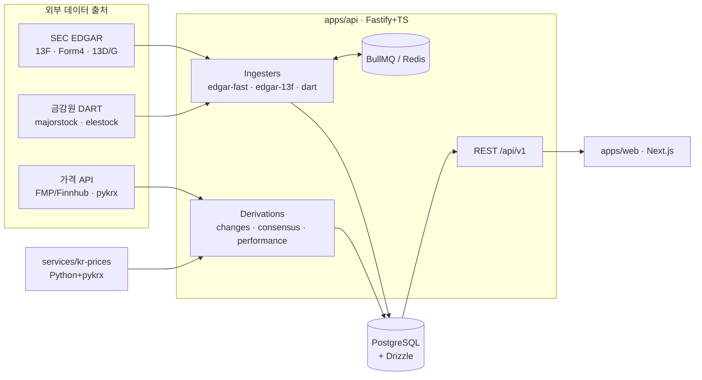
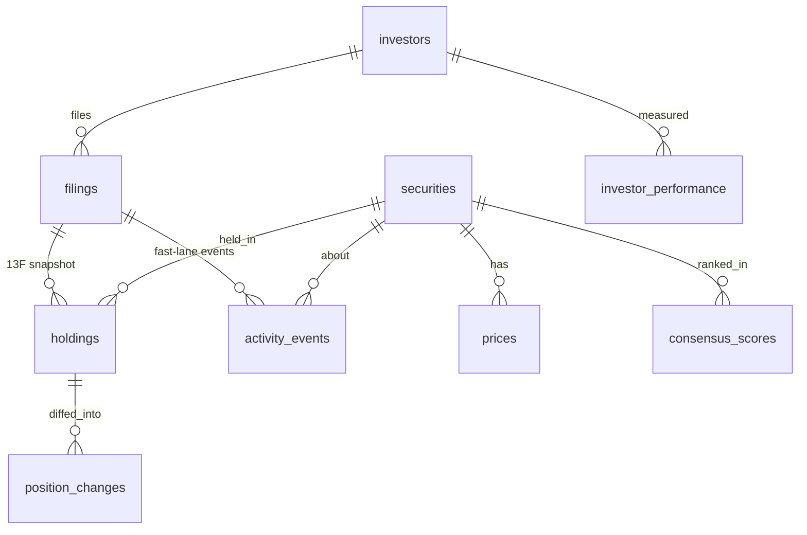

# Architecture — stock-recommend-app

> 이 문서는 시스템의 **깊은 레퍼런스**다. 제품 기획/로드맵은 [`PLAN.md`](./PLAN.md), 결정 근거는 [`ADR.md`](./ADR.md),
> 에이전트 운영 지침은 루트의 [`CLAUDE.md`](../CLAUDE.md) 참고.

## 1. 목표와 핵심 아이디어

거대 투자자가 **무엇을 사고/팔았는지**를 공개 규제 공시로 추적해 피드·랭킹·**정보**로 제공한다(개인화된 매매 권유가 아닌 **공시 정보 집계**).
핵심 설계 원칙은 **멀티-케이던스(multi-cadence)**: 단일 13F(분기, 최대 45일 지연)에 의존하지 않고,
사건 기반의 빠른 공시를 함께 써서 **일부 핵심 움직임**(US 내부자·액티비스트·한국 일반 5%)의 지연을 **45일 → 2~5일**로 줄인다.
**단 NPS(국내)·기관 패시브 13G는 구조적으로 느리다(아래 표).**

| 레인 | 공시 | 지연 | 산출물 | 무엇을 잡나 |
|---|---|---|---|---|
| **빠른** | Form 4 (US 내부자/10%↑) | T+2영업일 | `activity_events` | 임원·10%↑ 보유자 매매(버크셔 OXY 등). **파생(워런트) 포함** |
| 빠른 | 13D (US 액티비스트 5%) | T+5영업일(수정 2일) | `activity_events` | 경영참여·신규 대량지분 |
| 빠른 | DART 일반 5%·임원/주요주주 (KR) | T+5영업일 | `activity_events` | 한국 액티비스트·슈퍼개미·내부자(사건 기반) |
| **느린** | 13G (US 기관 패시브/QII) | 분기말+45일 | `activity_events` | 대형기관 패시브 5% — 분기 단위(빠르지 않음) |
| **느린** | 13F (US 포트폴리오) | 분기+45일 | `holdings` | 전체 보유 구성·비중 → 합의·시각화 맥락 |
| **느린** | DART 국민연금(약식·특례) | 분기/월 배치(최대 100일+) | `activity_events` | **NPS 국내 지분은 실시간 아님** |

두 레인은 상호보완이며, 글로벌 피드 = 두 레인의 합집합을 `filing_date` 최신순으로 `lane`/`source` 태그와 함께 노출.

## 2. 시스템 컨텍스트

## 3. 컴포넌트

| 컴포넌트 | 역할 | 기술 |
|---|---|---|
| `apps/api` | 인제스트·파생·REST API | Fastify, TypeScript, Drizzle |
| `apps/web` | MVP 프론트(피드/랭킹/프로필/시각화) | Next.js(App Router), Tailwind, Recharts |
| `packages/shared` | Zod 스키마 + 추론 타입 + API 클라이언트(단일 진실원) | TypeScript, Zod |
| `services/kr-prices` | 한국 EOD 가격(Phase 2) | Python, FastAPI, pykrx |
| PostgreSQL | 영속 저장(시계열·관계형) | Postgres (+추후 TimescaleDB) |
| Redis | 큐·레이트리미터·캐시 | BullMQ |

## 4. 데이터 플로우

1. **수집(Ingest)** — 스케줄러가 EDGAR/DART를 폴링 → 미수집 공시를 큐에 enqueue → 파서가 정규화해 `filings` + (`holdings` | `activity_events`) 적재. 멱등(accession unique).
2. **파생(Derive)** — 신규 공시 후 순수 SQL 잡 실행: `compute:changes`(13F 분기 diff), `compute:consensus`(보유 폭 + 최근 매수 가산 → 점수/랭크), (Phase 2) `compute:performance`.
3. **제공(Serve)** — REST `/api/v1`가 피드/합의/투자자/종목을 cursor 페이지네이션으로 반환. 응답에 `dataAsOf`·`disclaimer` 상시 포함.
4. **표현(Present)** — Next.js가 통합 피드(빠른 레인 헤드라인)·합의 Top-N·프로필·시각화를 렌더.

## 5. 데이터 모델

핵심 테이블(요약):
- **investors** — `slug, display_name, type(us_13f_manager|kr_disclosure_filer), source(edgar|dart), external_id(CIK/DART id), is_curated, parent_investor_id`. NPS는 미국분(EDGAR)·국내분(DART)을 `parent_investor_id`로 묶어 **합의 이중집계 방지**.
- **securities** — `cusip?, figi?, ticker?, name, market(US|KR), currency(USD|KRW), sector, industry`. 기업이벤트(분할·티커변경·합병·**CUSIP 변경**)로 식별자가 바뀌므로 **시점 버전** 관리.
- **cusip_map** — `cusip pk, security_id, ticker, confidence(exact|fuzzy|manual)`. 해결 보강: **OpenFIGI(무료) CUSIP→FIGI→티커** + 퍼지 + 수동.
- **corp_code_map** — `corp_code pk, stock_code, security_id`.
- **fx_rates** — `date, base(USD), quote(KRW), rate`. KR 공시는 KRW·주식수·지분%만 주므로 `value_usd` 산출에 **가격×수량×FX** 필요.
- **filings** — `investor_id, source, form_type, quarter?, report_date?, filing_date, accession_number, raw_url`. `(investor_id, accession_number)` **unique**.
  `form_type ∈ {13F-HR, 13F-HR/A, 4, SC 13D, SC 13G, 13D/A, 13G/A, majorstock, elestock}`.
- **holdings** (느린 레인 척추) — `filing_id, investor_id, security_id, quarter, shares, value_usd, pct_of_portfolio`. 13F 전체 스냅샷. **값 스케일 정규화**(과거 ×1000 vs 2023↑ 정수).
- **activity_events** (빠른 레인 척추) — `investor_id, security_id, source, form_type, event_type(BUY|SELL|STAKE_NEW|STAKE_INCREASE|STAKE_DECREASE|STAKE_EXIT), event_date, filing_date, shares_delta?, shares_after?, pct_of_company_after?, price_per_share?, value?, intent(active|passive|null), accession_number, raw_url`. `(investor_id, accession_number, security_id)` unique.
- **position_changes** (13F 파생) — `investor_id, security_id, quarter, prev_quarter, change_type(NEW|ADD|REDUCE|EXIT|HOLD), shares_delta, value_delta_usd`.
- **consensus_scores** (파생) — `security_id, quarter, holders_count, net_buyers_count, new_buyers_count, net_sellers_count, recent_activity_count, total_value_usd, score, rank`.
- **prices / benchmarks / investor_performance** — Phase 2(스키마는 지금 생성).

## 6. 인제스트 파이프라인

공통: 전역 throttle ≤8 req/s + `User-Agent: stock-recommend-app laegel1@gmail.com`. BullMQ(재시도·백오프). accession 멱등.

- **빠른 레인 — EDGAR (`ingest:edgar-fast`, 분 단위)**: 추적 CIK별 `data.sec.gov/submissions/CIK{10}.json` 폴링 → `{4, SC 13D, SC 13G, /A}` 미수집분 파싱.
  - Form 4 ownershipDocument XML: **Table I(비파생)+Table II(파생: 워런트/옵션) 모두** 파싱. reportingOwner·issuer·`transactionCode`(P/S/A/M/X/F…)·shares·price·sharesOwnedAfter → `BUY/SELL`. **다중 보고인(버크셔+버핏 동일주식) 이중집계 주의.**
  - 13D 구조화 XML(2024-12 의무화): subject company·`pct_of_company`·intent → `STAKE_*`. 13G(기관 패시브)는 분기 단위라 느린 레인.
- **DART (`ingest:dart`)**: `corpCode.xml`(**ZIP→압축해제**)→`corp_code_map`; `majorstock.json`(`stkqy/stkrt`)·`elestock.json`(`sp_stock_lmp_*` 스키마) → `activity_events`. 회사중심이라 **보유자명 정규화**. 한도 **20k/일·100사/쿼리** → 벌크·캐싱. **국민연금=약식·특례 → 분기/월 지연** 표기.
- **느린 레인 — 13F (`ingest:edgar-13f`, 분기 윈도우 매일/그외 주간)**: information table XML 파싱(상장옵션 `putCall` 포함) → `holdings`. 최근 ~8분기는 SEC **Bulk 13F Data Sets**로 백필.
- **CUSIP→티커**: `cusip_map` 조회 → miss 시 **OpenFIGI(무료 API)** + `nameOfIssuer`↔`company_tickers.json` 퍼지매칭, 저신뢰는 수동검토. 큐레이션 한정 **유한 문제**.

## 7. 추천 로직

- **(a) 빠른 레인 피드** — `activity_events` 최신순, 기본 `event_type ∈ {BUY, STAKE_NEW, STAKE_INCREASE}`. *"버핏 OXY 추가매수 · 어제 공시"*. (MVP 헤드라인)
- **(b) 느린 레인 변동** — 13F `position_changes` NEW/ADD.
- **(c) 합의 랭킹** — 가중합(상수 config):
  `score = w1·holders + w2·net_buyers + w3·new_buyers − w4·net_sellers + w5·log10(total_value) + w6·recent_activity`
  (시작값 1.0/1.5/2.0/1.0/0.5/1.5). 시장별 분기 내 rank. 추후 `investor_weight=f(win_rate, excess_return)` 곱으로 **성공률 가중**(스키마 변경 없음).

## 8. 성과/성공률 (Phase 2, 스키마 대비 완료)

포지션별 **filing_date 기준 forward return** → **초과수익** = return − benchmark(US:S&P500, KR:KOSPI). **승률** = 초과수익>0 비율.
**데이터**: 상업 라이선스 비용을 피해 **무료·지연(EOD) 데이터로 제한**(실시간 아님). pykrx/무료 티어는 상업 재배포 불가 → 표시 한계 명시 또는 KRX/유료 라이선스 검토.
**방법론 주의(반드시 UI 노출)**: 13F는 롱·미국상장만(공매도·헤지·현금·해외 없음) → 실제 실현손익 아님. **생존자 편향**(망한 펀드 공시 중단)·**벤치마크 불일치**·**45일 지연이 클로닝 알파 잠식**. → '예측'이 아닌 **정보**로 제시, **주장 전 백테스트 골든셋 검증**.

## 9. API 표면 (`/api/v1`, JSON, cursor)

- `GET /feed?lane=fast,slow&event_type=&market=&source=&investorId=` — 통합 피드(헤드라인)
- `GET /consensus?quarter=&market=&limit=` — 합의 랭킹
- `GET /securities/:id/consensus` · `GET /securities/:id/holders`
- `GET /investors` · `/:slug` · `/:slug/activity` · `/:slug/holdings` · `/:slug/changes`
- Phase 2: `/securities/:id/prices` · `/investors/:slug/performance` · `/meta/quarters` · `POST /alerts`
- 모든 응답: `dataAsOf` + `disclaimer`. ETag/Cache-Control.

## 10. 개발·검증 하네스 (에이전틱/하네스 엔지니어링)

이 프로젝트는 **AI 에이전트가 결정적 하네스 아래에서** 구현·유지한다. 시스템 자체가 검증 가능하도록 설계한다.

- **결정성**: 파서·파생은 순수 함수/순수 SQL. 외부 시간/난수 의존 최소화. 같은 입력 → 같은 출력.
- **골든 테스트**: 실제 공시 fixture(`apps/api/test/fixtures/*`)로 파서 회귀 방지. 새 공시 유형 추가 = 새 fixture + 기대 출력.
- **멱등 파이프라인**: accession unique key로 재실행 안전 → 에이전트가 인제스트를 마음껏 재시도.
- **계약 우선**: `packages/shared`의 Zod 스키마가 API↔프론트 계약. 타입 위반은 컴파일 타임에 차단.
- **검증 게이트**: `typecheck && lint && test` + 레이트리미트/멱등 체크 통과가 "완료"의 정의(루트 `CLAUDE.md`).
- (Phase 2) **추천 평가(eval)**: 합의/성과 로직에 대한 백테스트 골든셋으로 가중치 변경의 회귀 감지.

## 11. 배포 토폴로지 (초안)

- 단일 리전. `apps/api`(컨테이너) + Managed Postgres + Managed Redis. `apps/web`는 Vercel/Node 호스팅.
- 스케줄러는 api 프로세스 내 node-cron → BullMQ. `services/kr-prices`는 내부 네트워크 전용.
- 비밀: 환경변수(`DART_API_KEY`, `SEC_USER_AGENT`, 가격 API 키, DB/Redis URL). `.env.example` 제공.

## 12. 횡단 관심사

- **레이트리미트/매너**: SEC ≤8 req/s·UA 필수(없으면 403); DART **20k/일·100사/쿼리**·캐시; 가격 API 무료 티어 한도.
- **데이터 라이선스(비용 주의)**: SEC=공공 도메인. DART=출처표기·원본 재배포 금지. **pykrx=스크래핑(상업 부적합; KRX 2025-12 로그인형 전환)**, **FMP/Finnhub 무료 티어=상업 표시/재배포 불가** → 유료 라이선스 예산 필요. **CUSIP 목록 게시 금지**(CGS).
- **법적/규제**: 모든 화면·응답에 면책. **'추천' 아닌 '공시 정보 집계'로 프레이밍 + 비개인화**(한국 **유사투자자문업** 신고·미국 발행인 면제 경계). 유료화·개인화 전 법률 자문(ADR-0013).
